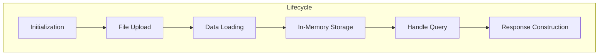

# 🤖 Agent Interaction Flow (LangChain)

This document details the step-by-step interaction flow for each LangChain-based agent, illustrating how inputs are consumed, processed, and transformed into structured outputs.

---

## 1. Common Lifecycle



1. **Initialization**: Instantiate agents in `backend/app.py`.
2. **File Upload**: Frontend sends file via `/api/upload`.
3. **Data Loading**: Agents parse and preprocess data.
4. **Storage**: Preprocessed data stored in dictionaries keyed by `file_id`.
5. **Handling Query**: Frontend sends `{scenario, message}` to `/api/chat`.
6. **Response Construction**: Agents return JSON messages or Base64 images.

---

## 2. IncidentRecallAgent Flow

```mermaid
flowchart LR
  subgraph IncidentRecallAgent
    A[[load_incidents(path)]] --> B[[pandas.read_excel(path)]]
    B --> C[[convert to list of dicts in self.incidents]]
    D[[handle("file_id::keyword")]] --> E[[filter records by substring match]]
    E --> F[[format results into JSON messages]]
  end
```

1. **load\_incidents(path)**

   * Reads the Excel file into a `pandas.DataFrame`.
   * Converts DataFrame rows to Python dictionaries stored in `self.incidents`.
2. **handle(payload)**

   * Splits `payload` into `file_id` and `query`.
   * Searches `self.incidents` for matches.
   * Builds a list of JSON-formatted messages for each matching record.

---

## 3. PDFQAAgent Flow

```mermaid
flowchart TD
  subgraph PDFQAAgent
    A[[load_document(doc_id, path)]] --> B[[extract_text(path) via PyMuPDF]]
    B --> C[[split_text into chunks (1k/100 overlap)]]
    C --> D[[compute embeddings with OpenAIEmbeddings]]
    D --> E[[index chunks in FAISS vectorstore]]

    F[[handle("doc_id::question")]] --> G[[similarity_search(question)]]
    G --> H[[load_qa_chain(OpenAI)]]
    H --> I[[chain.run(input_documents, question)]]
    I --> J[[return answer in JSON message]]
  end
```

1. **load\_document(doc\_id, path)**

   * Extracts raw text and splits into overlapping chunks.
   * Embeds chunks and indexes them with FAISS.
2. **handle(payload)**

   * Retrieves vectorstore by `doc_id`.
   * Runs a similarity search to fetch relevant chunks.
   * Executes the QA chain to produce a context-aware answer.

---

## 4. ImageVerificationAgent Flow

```mermaid
flowchart LR
  subgraph ImageVerificationAgent
    A[[load_document(doc_id, path)]] --> B[[extract_images via PyMuPDF]]
    B --> C[[create_heatmaps with Pillow + NumPy]]
    C --> D[[store heatmaps in self.heatmaps[doc_id]]]  

    E[[handle("file_id")]] --> F[[retrieve stored heatmaps]]
    F --> G[[encode each heatmap PNG to Base64]]
    G --> H[[return Base64 images in JSON messages]]
  end
```

1. **load\_document(doc\_id, path)**

   * Extracts images from PDF and generates grayscale heatmaps.
   * Stores the list of heatmap images keyed by `doc_id`.
2. **handle(file\_id)**

   * Fetches precomputed heatmaps for `file_id`.
   * Encodes each heatmap as a Base64 string and includes them in JSON responses.

---

## 5. Key LangChain Components

| Component                 | Description                                                      |
| ------------------------- | ---------------------------------------------------------------- |
| **CharacterTextSplitter** | Splits long text into overlapping chunks to preserve context     |
| **OpenAIEmbeddings**      | Converts text chunks into high-dimensional vector embeddings     |
| **FAISS**                 | In-memory vector index enabling efficient similarity searches    |
| **load\_qa\_chain**       | Constructs a retrieval-augmented QA pipeline over retrieved docs |
| **chain.run(...)**        | Executes the LLM chain to generate answers                       |


