## 📋 1. Common Request Handling

All three scenarios share a common request lifecycle:

```mermaid
flowchart TD
  U[User] -->|Interact via Streamlit UI| FE[Frontend]
  FE -->|POST /api/chat {scenario, message}| BE[Backend]
  subgraph Router
    BE --> SR[Scenario Router]
  end
  SR -->|"incident"| IRA[IncidentRecallAgent]
  SR -->|"pdf_qa"| PQ[PDFQAAgent]
  SR -->|"image_verify"| IVA[ImageVerificationAgent]
  IRA -->|returns messages| SR
  PQ  -->|returns messages| SR
  IVA -->|returns messages| SR
  SR -->|JSON {messages}| BE
  BE -->|HTTP response| FE
  FE -->|Render text/images| U
```

---

## 🔍 2. IncidentRecallAgent Flow

Handles Excel uploads and keyword searches over incident records.

```mermaid
flowchart LR
  subgraph Load & Store
    A["Backend: upload_incidents()"] --> B["IncidentRecallAgent.load_incidents(path)"]
    B --> C["pandas.read_excel → DataFrame"]
    C --> D["self.incidents = list of dicts"]
  end

  subgraph Query & Response
    E["Frontend: POST /api/chat\npayload: 'file_id::query'"] --> F["IncidentRecallAgent.handle(payload)"]
    F --> G["Split payload → file_id, query"]
    G --> H["Filter self.incidents for substring match"]
    H --> I["Build list of {'sender':'bot','text':…}"]
    I --> J["Return messages"]
  end
```



1. **load\_incidents(path)**

   * Reads Excel into a pandas DataFrame
   * Converts to `List[Dict]` stored in `self.incidents`.

2. **handle(payload)**

   * Splits on `"::"` to extract query
   * Performs case-insensitive substring search
   * Returns matching records as chat messages

---

## 📚 3. PDFQAAgent Flow

Processes large PDFs into embeddings and answers questions via a QA chain.

```mermaid
flowchart LR
  subgraph Ingestion
    A1["Backend: upload_pdf()"] --> B1["PDFQAAgent.load_document(doc_id,path)"]
    B1 --> C1["extract_text(path)\n(PyMuPDF)"]
    C1 --> D1["CharacterTextSplitter\n(chunk_size=1000, overlap=100)"]
    D1 --> E1["List of text chunks"]
    E1 --> F1["OpenAIEmbeddings → vectors"]
    F1 --> G1["FAISS.from_texts(chunks, embeddings)"]
    G1 --> H1["self.vectors[doc_id] = FAISS index"]
  end

  subgraph Question & Answer
    I1["Frontend: POST /api/chat\npayload: 'file_id::question'"] --> J1["PDFQAAgent.handle(payload)"]
    J1 --> K1["vectorstore = self.vectors[file_id]"]
    K1 --> L1["vectorstore.similarity_search(question) → docs"]
    L1 --> M1["load_qa_chain(OpenAI(), 'stuff')"]
    M1 --> N1["chain.run(input_documents=docs, question) → answer"]
    N1 --> O1["Return [{'sender':'bot','text': answer}]"]
  end
```



* **load\_document(doc\_id, path)**: builds FAISS index in memory.
* **handle(payload)**: similarity search + QA chain to generate answer.

---

## 🔎 4. ImageVerificationAgent Flow

Extracts images from PDFs and generates simple heatmaps highlighting tampering candidates.

```mermaid
flowchart LR
  subgraph Ingestion
    A2["Backend: upload_pdf()"] --> B2["ImageVerificationAgent.load_document(doc_id,path)"]
    B2 --> C2["extract_images(path)\n(PyMuPDF)"]
    C2 --> D2["List of PIL Images"]
    D2 --> E2["create_heatmap(image)\n(normalize grayscale)"]
    E2 --> F2["self.heatmaps[doc_id] = [heatmap images]"]
  end

  subgraph Validation & Response
    G2["Frontend: POST /api/chat\npayload: 'file_id'"] --> H2["ImageVerificationAgent.handle(file_id)"]
    H2 --> I2["Retrieve heatmaps list"]
    I2 --> J2["For each image:\n• Save to buffer\n• base64 encode"]
    J2 --> K2["Return [{'sender':'bot','heatmap': b64}, …]"]
  end
```



* **extract\_images(path)**: returns raw PIL images.
* **create\_heatmap(image)**: simple normalization for demo.
* **handle(file\_id)**: packages heatmaps as Base64 PNGs.

---

## 🧩 5. Key LangChain Components

| Component                 | Purpose                                           |
| ------------------------- | ------------------------------------------------- |
| **OpenAIEmbeddings**      | Convert text chunks into high-dimensional vectors |
| **CharacterTextSplitter** | Break large text into overlapping chunks          |
| **FAISS**                 | In-memory vector store for similarity search      |
| **load\_qa\_chain**       | Orchestrates retrieval + generation for PDF Q\&A  |
| **OpenAI (LLM wrapper)**  | Actual model calls to generate text responses     |
