# 🗺️ End-to-End User Flow & UI Component Details

This document provides a standalone overview of the complete user flow, interaction logic, and UI widget components for the Agentic System Chatbot. It can be added directly to your GitHub repository as `FLOW_DIAGRAM.md`.

---

## 1. User Interface Layout

The Streamlit frontend is divided into three main sections:

1. **Sidebar Navigation**

   * **Scenario Selector**: A `selectbox` widget to choose between:

     * 🚀 Incident Recall
     * 📚 PDF Q\&A
     * 🕵️ Document Verification
   * **Help & Settings**: Collapsible section for environment info and support links.

2. **Main Panel**

   * **Header**: Displays selected scenario name with an emoji icon and a brief description.
   * **File Uploader / Input Area**:

     * For Incident Recall: `file_uploader` (Excel) + `text_input` for query.
     * For PDF Q\&A & Doc Verification: `file_uploader` (PDF) + optional `text_input` (PDF Q\&A).
   * **Action Buttons**: `button` widget to trigger processing:

     * **Load Incidents** / **Get Incidents**
     * **Upload PDF** / **Get Answer**
     * **Validate Document**

3. **Result Display**

   * **Text Output**: `st.write` or `st.json` to show bot responses.
   * **Image Output**: `st.image` to render returned heatmap images.

```python
# Example widget declarations in Streamlit:
st.sidebar.title("🔍 Select Scenario")
mode = st.sidebar.selectbox("Choose Function", ["Incident Recall", "PDF Q&A", "Document Verification"])

if mode == "Incident Recall":
    incident_file = st.file_uploader("Upload Incidents Excel", type=["xlsx", "xls"])
    query = st.text_input("Keyword to search")
    if st.button("Get Incidents"):
        # call backend
```

---

## 2. Flow Diagram (Mermaid)

```mermaid
flowchart TD
  classDef sidebar fill:#1f77b4,stroke:#fff,color:#fff,stroke-width:2px;
  classDef main fill:#17becf,stroke:#fff,color:#000,stroke-width:2px;
  classDef backend fill:#ff7f0e,stroke:#fff,color:#fff,stroke-width:2px;
  classDef agent fill:#2ca02c,stroke:#fff,color:#fff,stroke-width:2px;
  classDef store fill:#d62728,stroke:#fff,color:#fff,stroke-width:2px;

  subgraph Frontend [🚀 Streamlit Frontend]
    direction TB
    A[📋 Sidebar: Scenario Selector]:::sidebar
    B[🔰 Main Panel: File Uploader & Input]:::main
    C[📨 Action Buttons]:::main
    D[📤 API Requests]:::main
    A --> B --> C --> D
  end

  D -->|POST /api/upload/incidents| E[🔷 Backend API]:::backend
  D -->|POST /api/upload/pdf| E
  D -->|POST /api/chat| E

  subgraph Backend [🏗️ FastAPI Backend]
    direction TB
    E
    F{📂 Scenario Router}:::backend
    F -->|Incident| G[📂 IncidentRecallAgent]:::agent
    F -->|PDF_QA| H[📄 PDFQAAgent]:::agent
    F -->|Image_Verify| I[🔍 ImageVerificationAgent]:::agent
  end

  G -->|Excel → pandas DataFrame| J[🗄️ Incidents Store]:::store
  H -->|Text → Chunks & Embeddings| K[🗄️ FAISS Vector Store]:::store
  I -->|Extract & Heatmap| L[🗄️ Heatmap Store]:::store

  J --> G
  K --> H
  L --> I

  G -->|JSON Response| M[📨 Backend Response]:::backend
  H -->|JSON Response| M
  I -->|JSON+Base64| M

  M -->|HTTP 200| N[🔙 Frontend Renderer]:::main
  N -->|st.write/st.image| O[👁️ User Sees Results]
```



---

## 3. Component & Widget Descriptions

| Section            | Widget(s)                                | Purpose                                          |
| ------------------ | ---------------------------------------- | ------------------------------------------------ |
| **Sidebar**        | `st.selectbox`, `st.info`, `st.markdown` | Navigate scenarios & view help links             |
| **File Uploader**  | `st.file_uploader`                       | Accept Excel or PDF files for processing         |
| **Input Fields**   | `st.text_input`                          | Enter keywords or natural-language questions     |
| **Action Buttons** | `st.button`                              | Trigger backend API calls                        |
| **Text Output**    | `st.write`, `st.json`                    | Display incident records or QA answers           |
| **Image Output**   | `st.image`                               | Render heatmap visuals for document verification |
